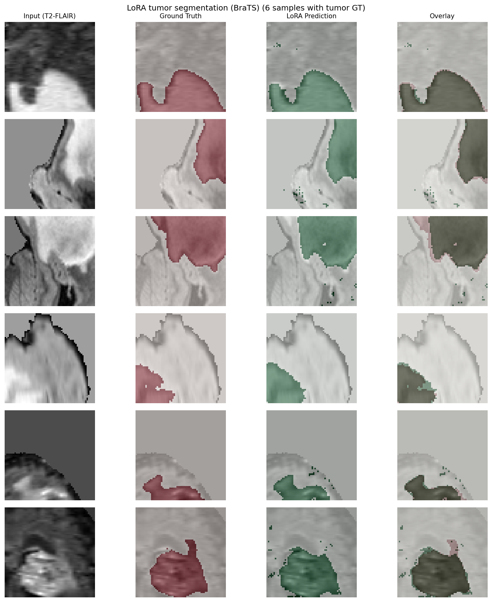

# Few-Shot Continual Learning for 3D Brain MRI

<p align="center">
  <a href="#english">English</a> · <a href="#%E4%B8%AD%E6%96%87">中文</a>
</p>

Frozen FOMO backbone + task-specific LoRA adapters for sequential few-shot continual learning on tumor segmentation (BraTS) and brain age regression (IXI).



---

<a name="english"></a>

## English

### Setup

```bash
# Python 3.9+ (3.10 recommended)
python -m venv venv && source venv/bin/activate  # Windows: venv\Scripts\activate

# Install dependencies
pip install -r requirements.txt

# Download pretrained weights (required for experiments)
./scripts/download_champion_weights.sh
```

### Reproduction

See **[REPRODUCTION.md](REPRODUCTION.md)** for step-by-step instructions.

**Quick summary:**
1. Prepare data: `scripts/prepare_plan_b_data.py` (Task 2 BraTS + Task 3 IXI)
2. Download weights: `./scripts/download_champion_weights.sh`
3. Run experiments: `python scripts/run_miccai_experiments.py --phase 1` (Phase 2, 3 optional)
4. Aggregate: `python scripts/aggregate_miccai_results.py n32`

### Quick Start (Dummy Data)

```bash
# LoRA continual learning (T2→T3)
python run_continual_lora.py --create_dummy --n_shot 32 --epochs 100 --lora_decoder

# Baselines
python run_continual_baselines.py --baseline sequential_linear --create_dummy --tasks 2 3
python run_continual_baselines.py --baseline sequential_ft --create_dummy --tasks 2 3
```

### Project Structure

```
FewShot3DBrain/
├── src/                    # Core: data.py, lora.py, models.py, train.py, backbone
├── scripts/
│   ├── prepare_plan_b_data.py   # Data prep (BraTS, IXI)
│   ├── run_miccai_experiments.py # Experiment orchestration
│   ├── aggregate_miccai_results.py # Result aggregation
│   └── download_champion_weights.sh # Pretrained weights
├── run_continual_lora.py    # Proposed LoRA
├── run_continual_baselines.py # Sequential Linear / FT
├── run_continual_ewc.py     # EWC baseline
├── run_continual_lwf.py     # LwF baseline
├── run_continual_replay.py  # Replay baseline
├── run_baselines.py         # Per-task baselines
├── run_multi_seed.py        # Multi-seed runs
├── run_ablations.py        # Shot / LoRA ablations
├── data/                   # preprocessed/ (gitignored)
├── weights/                # Pretrained (gitignored)
├── outputs/                # Experiment outputs (gitignored)
├── MICCAI_paper/           # LaTeX paper (figures, sections)
├── EXPERIMENT_RESULTS.md   # Detailed results
└── REPRODUCTION.md         # Reproduction guide
```

---

<a name="中文"></a>

## 中文

凍結 FOMO backbone + 任務專用 LoRA adapters，用於 BraTS 腫瘤分割與 IXI 腦齡估計的序貫少樣本持續學習。

### 安裝

```bash
# Python 3.9+（建議 3.10）
python -m venv venv && source venv/bin/activate  # Windows: venv\Scripts\activate

pip install -r requirements.txt
./scripts/download_champion_weights.sh
```

### 重現實驗

詳見 **[REPRODUCTION.md](REPRODUCTION.md)**。

### 專案結構

見上方 English 區塊。
